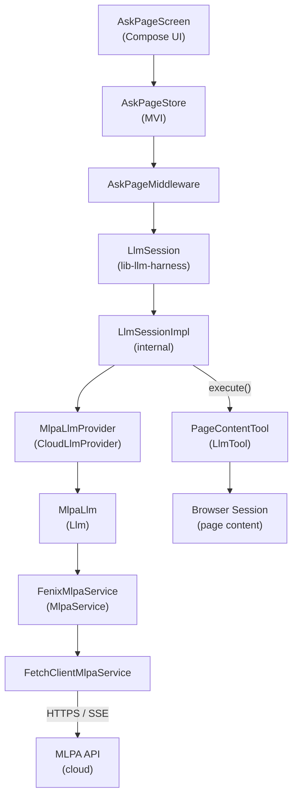
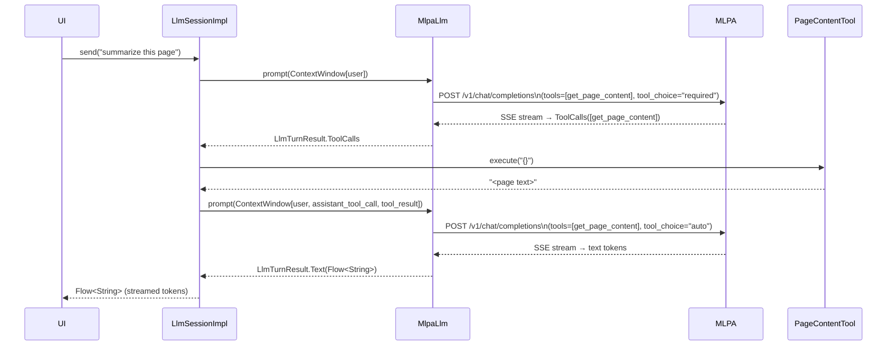

# LLM Tool Calling Prototype: Engineering Summary

## Overview

This document captures the design, implementation, and lessons learned from the "ask about this page" prototype. The feature lets users ask natural-language questions about the page they're viewing, answered by the MLPA cloud inference service using a tool-calling loop to fetch page content on demand.

The prototype is working end-to-end. This document also describes known rough edges and a forward implementation plan for cleaning them up.

---

## Architecture

### Component Structure



### Tool-Call Turn Sequence



---

## Implementation Phases

### 1. `Llm.ContextWindow` refactor (`Bug 2035653`)

The original `Llm.prompt(Prompt)` accepted a flat `(userPrompt, systemPrompt?)` pair — enough for single-turn summarization but not for multi-turn conversation or tool results. We replaced it with `Llm.ContextWindow`, a typed ordered list of `Llm.Message` variants:

| Type | Purpose |
|---|---|
| `System` | Shapes model behaviour for the session |
| `User` | The human's input |
| `Assistant` | A text response from the model |
| `AssistantToolCall` | An assistant turn that requested tool invocations |
| `Tool` | A tool result fed back to the model |

`Llm.prompt()` now returns `Llm.LlmTurnResult`, which is either `Text(Flow<String>)` or `ToolCalls(List<ToolCall>)`.

### 2. Conversational UI (`Bug 2035652`, `working prototype`)

Added `feature-ask-page`: a `MviStore`-backed bottom sheet (`AskPageScreen`) wired into `SummarizationFragment`. The store owns the displayed message history; `AskPageMiddleware` drives `LlmSession` and appends streamed tokens to the last message as they arrive.

### 3. Harness library (`lib-llm-harness`)

Consumer code shouldn't know about context trimming, failover, or the tool-call round-trip. `LlmSession` is the public interface:

```kotlin
val session = LlmSession.create(
    LlmSessionConfig(
        providers = listOf(mlpaProvider),
        tools = listOf(PageContentTool { browser.getPageContent() }),
        systemPrompt = "...",
    )
)
val tokens: Flow<String> = session.send("summarize this page")
```

`LlmSessionImpl` (internal) owns conversation history, calls `Llm.prompt()`, detects `ToolCalls`, dispatches to registered `LlmTool.execute()` implementations, and loops until a `Text` result arrives — invisible to consumers. `maxToolRounds` (default 5) guards against infinite loops.

`LlmTool` is a simple interface: `name`, `description`, `parametersSchema` (a JSON Schema string), and `execute(arguments: String): String`. `PageContentTool` wraps a `getContent: suspend () -> String` lambda so the feature layer supplies its own extraction logic.

Supporting concepts added to `concept-llm`: `LlmTool`, `LlmSession`, `LlmSessionConfig`, `LlmProvider`/`CloudLlmProvider`/`LocalLlmProvider`, `ContextWindowStrategy`, `LlmFailoverStrategy`, `LlmPreparationStrategy`.

### 4. MLPA tool calling wire-up

Extended `ChatService.Request` with `tools: List<Tool>?` and `toolChoice: String?`. Added `ChatService.completionWithTools()` alongside the existing `completion()`, streaming tool-call SSE chunks and assembling `ToolAwareResponse`. Updated `FetchClientMlpaService` to implement both. Updated `MlpaLlm` to route to the right method based on whether tools are present in the `ContextWindow`.

---

## Challenges and Bugs

### `"content": null` causing 400 errors

The `FetchClientMlpaService` JSON serializer is configured with `encodeDefaults = true` so that non-null default fields like `stream = true` are included on the wire. A side effect: nullable fields defaulting to `null` (e.g., `content: String? = null` on an assistant tool-call message) were serialized as `"content": null`, which MLPA rejected.

**Workaround**: annotate each nullable-default field with `@EncodeDefault(EncodeDefault.Mode.NEVER)`.

**Better fix**: see [Implementation Plan](#1-unify-completion-and-completionwithtools) below — `explicitNulls = false` in the Json config makes this automatic.

### GeckoView SSL regression (network errors)

All MLPA calls began failing with `WebRequestError: category=0x2` (SSL/certificate error). Unrelated to this work — an in-flight GeckoView bug on the branch. Resolved by rebasing to pick up the fix. The symptom (a `ChatServiceError.NetworkError` with no other context) was hard to distinguish from a real network problem; better error messaging in that path would help.

### Model ignoring tools ("I don't have the ability to browse the web")

The model was responding as if no tools were available. Root cause: `ChatService` was a `fun interface`, which in Kotlin means objects implementing it via SAM conversion only define the single abstract method. The default `completionWithTools()` method on `fun interface` is not reliably inherited by all implementations. We changed it to a plain `interface`.

This fixed the dispatch problem generically, but the model still wasn't calling the tool because the actual call path went through `FenixMlpaService` — a wrapper that delegates to `FetchClientMlpaService`. `FenixMlpaService` overrode `completion()` but not `completionWithTools()`, so the default interface implementation (which calls `this.completion()` and collects plain text) ran instead.

**Fix**: add the missing `completionWithTools` override to `FenixMlpaService`.

**Root cause of root cause**: `FenixMlpaService` is a leaky abstraction — any new method on `ChatService` silently falls back to the default implementation until it's explicitly proxied.

### `tool_choice: "required"` infinite loop

Setting `tool_choice: "required"` forced the model to call `get_page_content` on the first turn. But on the second turn (with page content already in the context), it was still being forced to call the tool again, looping until `maxToolRounds` cut it off and producing an empty response.

**Fix**: inspect the context: use `"required"` when no tool results are present yet, switch to `"auto"` once tool results exist.

**Better fix**: see [Implementation Plan](#2-move-tool_choice-logic-to-the-session-harness) — this decision belongs in the session harness, not in request building.

### SSE streaming format for tool calls

Tool-call arguments arrive incrementally across multiple SSE events, keyed by index:

```
data: {"choices":[{"delta":{"tool_calls":[{"index":0,"id":"abc","function":{"name":"get_page_content","arguments":""}}]}}]}
data: {"choices":[{"delta":{"tool_calls":[{"index":0,"function":{"arguments":"{}"}}]}}]}
```

`toolAwareStreamResponse()` accumulates partial calls in a `mutableMapOf<Int, PartialCall>` and assembles the final `ToolAwareResponse.ToolCalls` after the stream closes.

---

## Prototype Cleanup

Before shipping any part of this work, the following should be addressed:

- Remove `Log.e` debug statements from `FetchClientMlpaService`.
- Resolve the two design issues described in the next section.
- Consider removing `FenixMlpaService` (see [Optional](#optional-remove-fenixmlpaservice)).

---

## Implementation Plan

### 1. Unify `completion` and `completionWithTools`

**Problem**: Two separate methods on `ChatService` with different return types (`Flow<String>` vs. `ToolAwareResponse`) force every proxy class (e.g., `FenixMlpaService`) to override both. A missing override silently falls back to the default, as we discovered. The split also makes `MlpaLlm` unnecessarily complex.

**Proposed change**: Replace both methods with a single `completion()` returning `Flow<TurnEvent>`:

```kotlin
interface ChatService {
    fun completion(authorizationToken: AuthorizationToken, request: Request): Flow<TurnEvent>

    sealed class TurnEvent {
        data class TextDelta(val text: String) : TurnEvent()
        data class ToolCalls(val calls: List<ToolCallRecord>) : TurnEvent()
    }
}
```

- Text completions emit many `TextDelta` events.
- Tool-calling completions emit a single `ToolCalls` event.
- `FetchClientMlpaService` reads the SSE stream and emits the appropriate event type.
- `MlpaLlm.prompt()` collects the flow, distinguishes text from tool calls, and returns `LlmTurnResult`.
- Consumers that only care about text (e.g., `GeminiNanoLlm`) collect and filter for `TextDelta`.

**Steps**:
1. Add `TurnEvent` sealed class to `ChatService`.
2. Replace `completion(): Flow<String>` and `completionWithTools(): ToolAwareResponse` with `completion(): Flow<TurnEvent>` on `ChatService`.
3. Update `FetchClientMlpaService.completion()` to emit `TurnEvent` (merge `contentFlow` and `toolAwareStreamResponse` into a single flow).
4. Update `MlpaLlm.prompt()` — collect the flow, fold `TextDelta` tokens into a `Flow<String>` for `LlmTurnResult.Text`, or surface `ToolCalls` directly.
5. Update `GeminiNanoLlm` to filter `.filterIsInstance<TurnEvent.TextDelta>().map { it.text }`.
6. Remove `ToolAwareResponse`, `completionWithTools`, and all `fun interface` / SAM concerns.
7. Update fakes in tests.

### 2. Fix null serialization (`@EncodeDefault` sprawl)

**Problem**: `FetchClientMlpaService` uses `Json { encodeDefaults = true }` so that non-null primitive defaults (`stream = true`, `temperature = 0.1f`) appear on the wire. This causes nullable fields defaulting to `null` to serialize as `"content": null`, breaking MLPA. The current workaround is per-field `@EncodeDefault(EncodeDefault.Mode.NEVER)` annotations — fragile because any new nullable field is a latent bug until annotated.

**Proposed change**: Add `explicitNulls = false` to the Json config:

```kotlin
private val json by lazy {
    Json {
        ignoreUnknownKeys = true
        encodeDefaults = true
        explicitNulls = false  // null fields are omitted, not serialized as null
    }
}
```

`explicitNulls = false` (available since kotlinx.serialization 1.3) omits all null values from serialized output without requiring per-field annotations. Non-null defaults (like `stream = true`) are still included because `encodeDefaults = true` governs non-null defaults.

**Steps**:
1. Add `explicitNulls = false` to the `Json` builder in `FetchClientMlpaService`.
2. Remove all `@EncodeDefault(EncodeDefault.Mode.NEVER)` annotations from `ChatService.Request.Message` and `ChatService.Request`.
3. Add a test asserting that a `Message` with `null` content does not serialize `"content": null`.

### 3. Move `tool_choice` logic to the session harness

**Problem**: `MlpaLlm.asRequest` inspects `ContextWindow.messages` to decide between `tool_choice = "required"` and `"auto"`. This mixes request-building with session-turn logic and couples `MlpaLlm` to knowledge about how many tool rounds have occurred.

**Proposed change**: Add a `toolChoice: ToolChoice` field to `Llm.ContextWindow`. `LlmSessionImpl` sets it when building the context window for each turn. `MlpaLlm.asRequest` maps it to the MLPA wire value without inspecting history.

```kotlin
enum class ToolChoice {
    Auto,     // model decides whether to call a tool
    Required, // model must call a tool this turn
    None,     // model must not call any tools
}

data class ContextWindow(
    val messages: List<Message>,
    val tools: List<LlmTool> = emptyList(),
    val toolChoice: ToolChoice = ToolChoice.Auto,
)
```

In `LlmSessionImpl.buildContextWindow()`:
```kotlin
val toolChoice = if (config.tools.isNotEmpty() && history.none { it is Llm.Message.Tool }) {
    ToolChoice.Required
} else {
    ToolChoice.Auto
}
return ContextWindow(messages, config.tools, toolChoice)
```

In `MlpaLlm.asRequest`:
```kotlin
toolChoice = when {
    tools.isEmpty() -> null
    else -> when (toolChoice) {
        ToolChoice.Required -> "required"
        ToolChoice.Auto -> "auto"
        ToolChoice.None -> "none"
    }
},
```

`ToolChoice` belongs in `concept-llm` so all `Llm` implementations can consume it. Backends that don't support the concept (e.g. Gemini Nano) can ignore the field.

---

## Optional: Remove `FenixMlpaService`

`FenixMlpaService` is marked "temporary for toggling between prod and nonprod environments." It currently proxies three methods (`verify`, `completion`, `completionWithTools`) and will silently miss any future `ChatService` additions until explicitly patched.

The prod/nonprod toggle could be moved directly onto `FetchClientMlpaService` or onto `MlpaConfig` selection at injection time, eliminating the proxy class entirely. This is low-risk and should be done before `FenixMlpaService` acquires more surface area.
